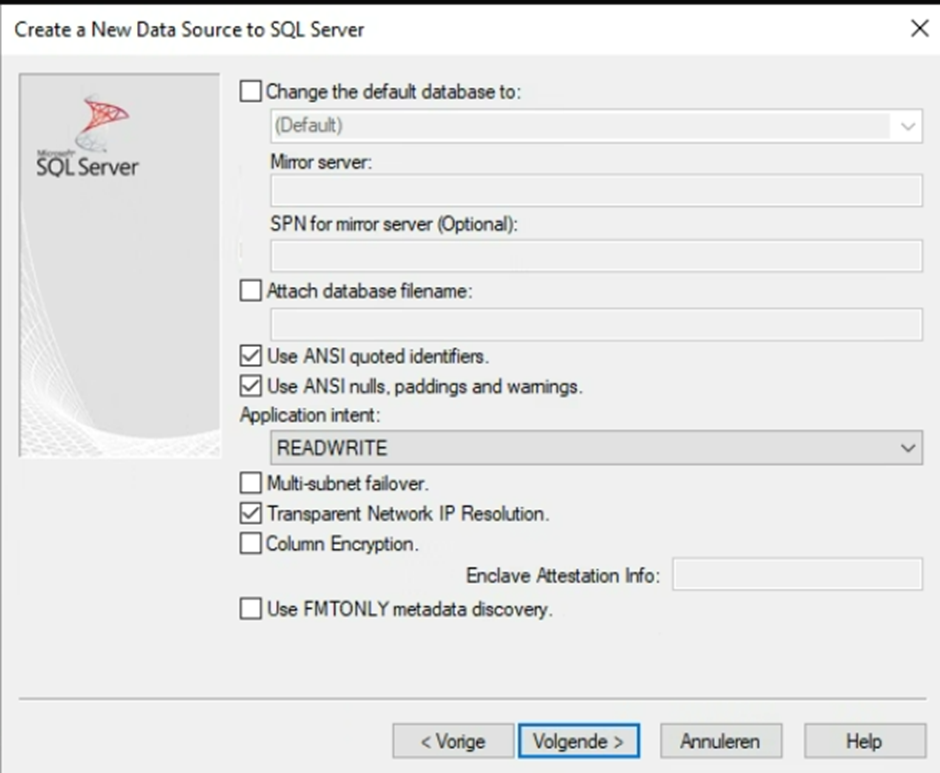

# Vereisten
- PWN medewerker
- Mogelijkheid tot downloaden van Anaconda uit bedrijfsportal
- Mogelijkheid tot downloaden van ODBC driver 17 uit bedrijfsportal
- Toegang tot de Dawaco SQL server
- Geduld

# Installaties vanuit bedrijfsportal
-	Open de bedrijfsportal via Windows Start > “Bedrijfsportal”
-	Installeer ODBC driver 17
-	Installeer Anaconda

# Configureer Python omgeving
-	Open Anaconda Navigator
-	Open “Prompt”
-	Type: conda create --name dawacotoolsenv python=3.10
-	Hij doet dan een voorstel voor welke packages je kan installeren. Type dan y en dan enter
-	Type: activate dawacotoolsenv
-	Type: pip install https://github.com/bdestombe/python-dawaco-tools/archive/main.zip
-	Type: pip install notebook jupyterlab

# Update dawacotools
-	Open Anaconda Navigator
-	Open “Prompt”
-	Type: activate dawacotoolsenv
-	Type: pip install https://github.com/bdestombe/python-dawaco-tools/archive/main.zip --upgrade

# Configureer ODBC driver
-	Windows Start > “odbc” -> de 64-bit versie
-	Toevoegen
-	
-	Name: Dawaco
-	Server: pwnka-a-we-acc-dawaco-sql.database.windows.net
-   

# Start en test Python omgeving
-	Open Anaconda Navigator
-	Open “Prompt”
-	Type: activate dawacotoolsenv
-	Type: python
-	Type: from dawacotools.io import get_daw_mps
-	Type: get_daw_mps()
-	Op het scherm verschijnt een stuk van een tabel met eigenschappen van peilbuizen
Bel me even op als het lukt of niet lukt.

# Start tutorials
Als het is gelukt om get_daw_mps() te draaien kan je beginnen met de tutorials.
1.	Maak een werkmap aan via je verkenner.
2.	Ga naar https://github.com/bdestombe/python-dawaco-tools in je browser. Klik op de groene “Code” knop en vervolgens “Download zip”.   
3.	Pak het gedownloade zip-bestand uit in je werkmap.
4.	Open Anaconda Navigator
5.	Open “Prompt”
6.	Type: activate dawacotoolsenv
7.	Pas aan zodat het pad verwijst naar het uitgepakte sub-mapje tutorials. Type: jupyter notebook --notebook-dir="C:\Users\tombb\Python scripts\python-dawaco-tools\tutorials" 
8.	Een browser opent met een jupyter omgeving waarin je de tutorials kan draaien.
